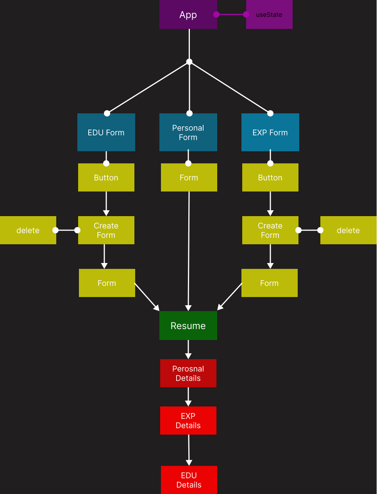
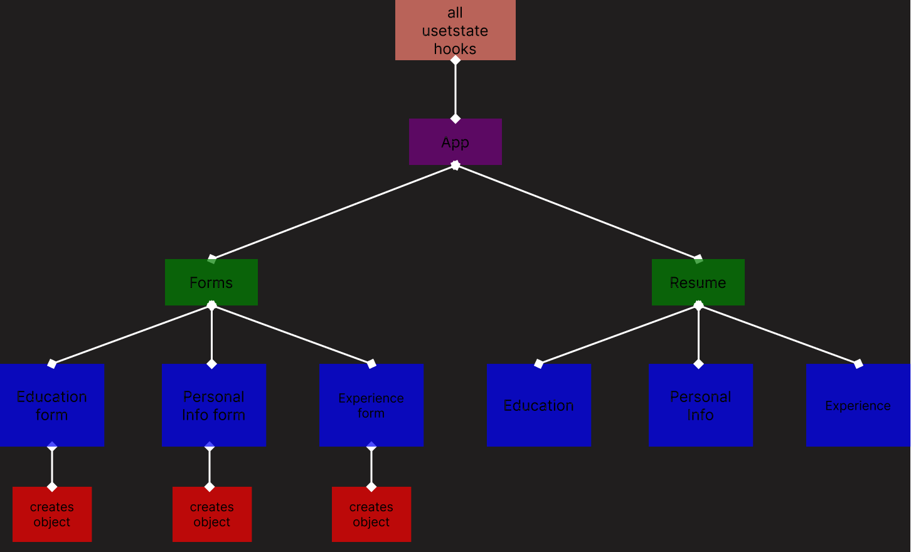
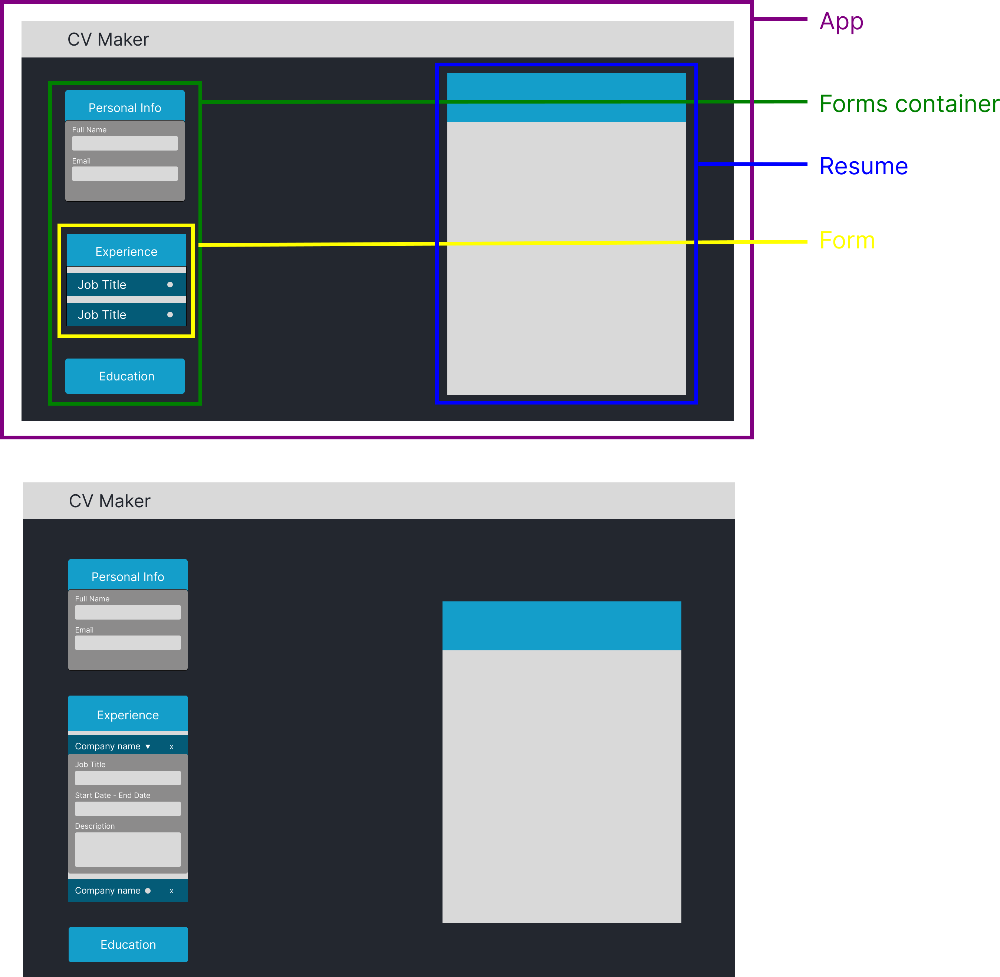

# CV Maker

## Version 1.0

This Version allows you too add, edit, and delete items to a resume!

## Install

There are no install steps, here's the link:

https://creative-gumption-e93819.netlify.app/

## Built With

  
## Dev Notes

This project was fantastic for learning React. It compelled me to grasp and apply the useState and props flow, offering flexibility in implementing reusable components.

For the most part, this project was straightforward. However, I encountered challenges when attempting to make the resume items editable. Since useState and props were new concepts for me at the project's outset, my files became convoluted and confusing. This prompted me to create an App Flow chart and UI wireframe in Figma. This visual aid helped me better visualize the structure and intricacies of the project, encouraging a more thoughtful approach rather than solely coding until encountering issues.

### App Flow Rendition 1

### App Flow Rendition 2

### App Wireframe

While the final version of 1.0 looks a bit different the the Appl flow chart, the chart laid a great foundation down for me to problem solve and finish this project.

## License

MIT License

Copyright (c) 2024 Dylon Crowley-Perez

Permission is hereby granted, free of charge, to any person obtaining a copy
of this software and associated documentation files (the "Software"), to deal
in the Software without restriction, including without limitation the rights
to use, copy, modify, merge, publish, distribute, sublicense, and/or sell
copies of the Software, and to permit persons to whom the Software is
furnished to do so, subject to the following conditions:

The above copyright notice and this permission notice shall be included in all
copies or substantial portions of the Software.

THE SOFTWARE IS PROVIDED "AS IS", WITHOUT WARRANTY OF ANY KIND, EXPRESS OR
IMPLIED, INCLUDING BUT NOT LIMITED TO THE WARRANTIES OF MERCHANTABILITY,
FITNESS FOR A PARTICULAR PURPOSE AND NONINFRINGEMENT. IN NO EVENT SHALL THE
AUTHORS OR COPYRIGHT HOLDERS BE LIABLE FOR ANY CLAIM, DAMAGES OR OTHER
LIABILITY, WHETHER IN AN ACTION OF CONTRACT, TORT OR OTHERWISE, ARISING FROM,
OUT OF OR IN CONNECTION WITH THE SOFTWARE OR THE USE OR OTHER DEALINGS IN THE
SOFTWARE.
